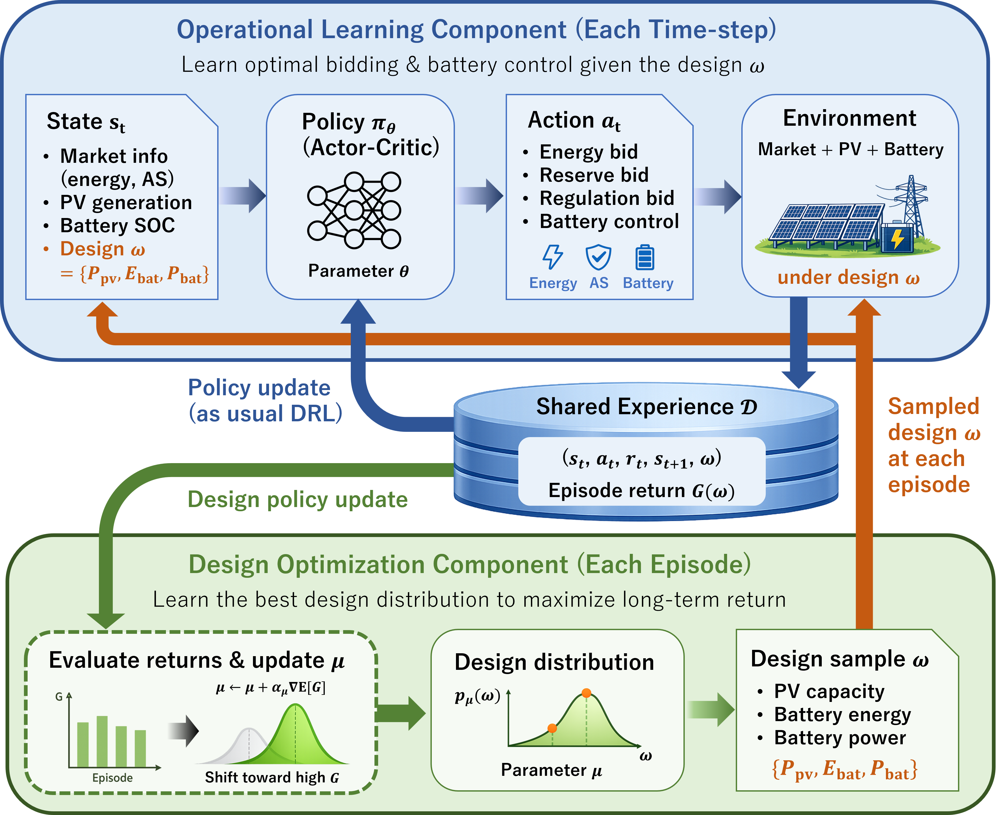

# HROpt

**Optimal design of solar-battery hybrid resources considering multi-market participation under weather and price uncertainty**

This repository contains the implementation and simulation results for the paper:

> Hikaru Hoshino, Taiyo Mantani, and Eiko Furutani,  
> *Optimal design of solar-battery hybrid resources considering multi-market participation under weather and price uncertainty*

The project studies **PV-battery hybrid resource design and operation** under uncertainty using **deep reinforcement learning (DRL)**. The framework jointly optimizes:

- PV capacity
- battery power capacity
- battery energy capacity
- multi-market bidding and battery operation

The target setting is a hybrid resource participating in **energy**, **ancillary service**, and **capacity** markets while considering renewable forecast errors, battery constraints, and market uncertainty.

<p align="center">
  
</p>

## Overview

Hybrid resources that integrate PV and battery storage can exploit multiple value streams, but their design and operation are tightly coupled. This repository implements a DRL-based co-optimization framework that embeds design variables directly into the learning process so that sizing and operation are optimized in a unified stochastic setting.

The repository includes:

- training code for the proposed co-optimization method
- environment and agent definitions
- simulation logs for the experiments reported in the paper
- CAISO-based market and solar data used in the case studies
- plotting scripts and figure files used in the manuscript

---

## Main Features

- **Joint design-and-operation optimization** for PV-battery hybrid resources
- **Multi-market participation** across energy and ancillary service markets
- **Comparison between hybrid and co-located configurations**
- **Scenario analysis** for market and policy changes
- **Year-long distributed RL experiments** for long-horizon planning studies

---

## Repository Structure

```text
HROpt/
├── agent/                  # DRL agents, neural-network models, and learning utilities
├── rl_env/                 # Market environment and hybrid-resource simulation models
├── data/                   # Input data (CAISO prices, solar generation, and related datasets)
├── codesign_ddpg_logs/     # Simulation logs for DDPG-based co-optimization runs
├── codesign_apex_logs/     # Simulation logs for distributed/year-long co-optimization runs
├── comparison_logs/        # Simulation logs for hybrid vs co-located comparison studies
├── plot/                   # Figure files used in the paper
├── main_codesign_ddpg.py   # Main script for standard co-optimization experiments
├── main_codesign_ddpg_apex.py
│                           # Main script for distributed/year-long experiments
├── plot_bar_graph.py       # Plotting script for revenue summaries
├── plot_bar_graph_4cases.py
│                           # Plotting script for the four scenario cases
├── plot_bar_graph_hybrid_vs_colocated.py
│                           # Plotting script for hybrid vs co-located comparison
├── plot_learning_curve.py  # Plotting script for training curves
├── plot_market_data.py     # Plotting script for market-operation time series
├── plot_market_data_hybrid_vs_co-located.py
│                           # Plotting script for hybrid vs co-located time series
├── plot_mu_progress.py     # Plotting script for design-parameter evolution
└── .gitignore
```

---

## Correspondence to the Paper

The repository is organized to match the main numerical studies in the paper.

### 1. Hybrid vs co-located comparison

This part evaluates the operational and economic differences between hybrid and co-located resources under fixed system sizes.

Relevant files and folders:

- `comparison_logs/`
- `plot/plot_hybrid_vs_colocated.pdf`
- `plot/plot_learning_curve.pdf`
- `plot/plot_market_data_hybrid.pdf`
- `plot/plot_market_data_co-located.pdf`

### 2. Co-optimization under four scenarios

This part jointly optimizes system design and market participation under different market and policy assumptions.

Relevant files and folders:

- `codesign_ddpg_logs/`
- `plot/plot_bars_graph_4cases.pdf`
- `plot/plot_mu_progress.pdf`
- `plot/plot_market_data_case1.pdf`
- `plot/plot_market_data_case2.pdf`
- `plot/plot_market_data_case3.pdf`
- `plot/plot_market_data_case4.pdf`

### 3. Year-long analysis with distributed RL

This part demonstrates applicability to long-term data using parallel experience collection.

Relevant files and folders:

- `codesign_apex_logs/`
- `plot/plot_monthly_breakdown.pdf`
- `plot/plot_market_data_month_7.pdf`
- `plot/plot_market_data_month_9.pdf`
- `plot/plot_market_data_month_12.pdf`

---

## Data

The `data/` folder contains the time-series data used in the numerical studies, based on **historical CAISO market data** and solar generation data.

In the paper, the simulations use:

- electricity market price data derived from CAISO
- solar generation profiles derived from CAISO-related historical data
- hourly resolution data for the case studies

Please refer to the paper for the exact preprocessing assumptions and parameter settings.

---

## Simulation Logs

The folders ending with `_logs` store the simulation outputs generated during training and evaluation.

Typical contents may include:

- episode rewards
- learned design parameters
- revenue breakdowns
- saved results for post-processing and plotting

These logs are separated by experiment type so that the results reported in different sections of the paper can be reproduced and analyzed independently.

---

## Figures Used in the Paper

The `plot/` folder contains figure files corresponding to the manuscript results, including:

- framework overview
- learning curves
- revenue breakdown bar charts
- time-series market participation plots
- design-parameter evolution plots
- monthly breakdowns for the year-long study

These files can be used to quickly inspect the main findings without rerunning all experiments.

---

## Running the Code

### Requirements

Please prepare a Python environment with the libraries used in the implementation, including for example:

- `numpy`
- `pandas`
- `matplotlib`
- `torch`

Depending on the experiment, additional packages may be required.

### Example entry points

```bash
python main_codesign_ddpg.py
python main_codesign_ddpg_apex.py
```

After training or evaluation, the plotting scripts can be used to reproduce the figures.

---

## Reproducibility Notes

- The repository contains both the implementation and logged results.
- Because DRL-based optimization is stochastic, repeated runs with different random seeds may lead to slightly different solutions.
- The paper reports representative solutions selected from multiple runs.

---

## Key Findings from the Paper

The experiments in the paper show that:

- hybrid resources outperform co-located resources under the tested settings
- co-optimization of sizing and operation improves economic performance compared with fixed-design operation
- market and policy changes can significantly alter the optimal PV-battery configuration
- seasonal variability affects both revenue composition and optimal operating strategies

---

## Citation

If you use this repository in your research, please cite the associated paper.

```bibtex
@article{hoshino2026hropt,
  title   = {Optimal design of solar-battery hybrid resources considering multi-market participation under weather and price uncertainty},
  author  = {Hoshino, Hikaru and Mantani, Taiyo and Furutani, Eiko},
  journal = {Applied Energy},
  year    = {2026}
}
```

---

## License

This repository is released under the **MIT License**.

---

## Contact

For questions regarding the paper or the code, please contact the authors.

- Hikaru Hoshino
- Taiyo Mantani
- Eiko Furutani
